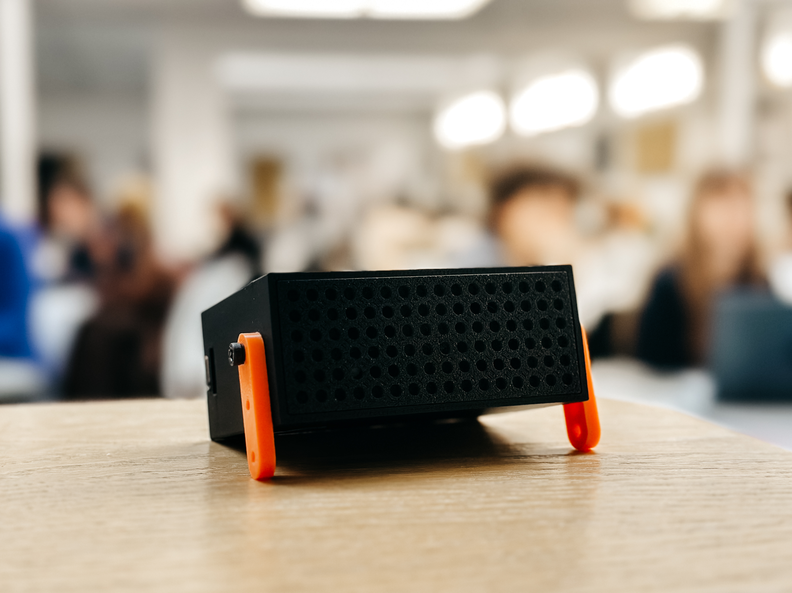

# Ambient Edu

An educational air quality monitoring kit by [Ambient Works](https://ambientworks.io). Designed in collaboration with the [Creative Computing Diploma](https://www.arts.ac.uk/subjects/creative-computing/undergraduate/ual-creative-computing-institute-diploma) at CCI, UAL — London.

<p align="center">
  
</p>

---

## What's in the Kit

| Component | Description |
|---|---|
| **SparkFun ESP32-C6 Thing Plus** | Wi-Fi 6 microcontroller with USB-C, Qwiic connector, and onboard LED. [Hardware guide →](https://docs.sparkfun.com/SparkFun_Thing_Plus_ESP32_C6/hardware_overview/) |
| **Sensirion SEN66** | All-in-one environmental sensor: PM1.0, PM2.5, PM4, PM10, CO₂, VOC, NOx, temperature, and humidity. [Datasheet →](https://sensirion.com/media/documents/SEN6x_Datasheet.pdf) |
| **Qwiic Cable** | Pre-wired I²C cable — plug-and-play, no soldering needed |

---

## Getting Started

### 1. Install Arduino IDE

Download [Arduino IDE 2.x](https://www.arduino.cc/en/software).

### 2. Add ESP32 Board Support

1. Open **Arduino IDE → Settings**
2. In **Additional Board Manager URLs**, add:
   ```
   https://espressif.github.io/arduino-esp32/package_esp32_index.json
   ```
3. Go to **Tools → Board → Boards Manager**, search for **esp32**, and install **esp32 by Espressif Systems** 
4. Select **Tools → Board → esp32 → SparkFun ESP32-C6 Thing Plus**

### 3. Install Libraries

Open **Sketch → Include Library → Manage Libraries** and install:

- **Adafruit NeoPixel**
- **Sensirion I2C SEN66** (also installs Sensirion Core)

### 4. Connect the Hardware

1. Connect the SEN66 to the board using the Qwiic cable
2. Plug in USB-C to your computer
3. Select the correct port in **Tools → Port**

### 5. Upload an Example

Open one of the sketches from the [`examples/`](examples/) folder, verify, and upload!

---

## Examples

### Example 1 — [Sensor Read](examples/01-sensor-read/01-sensor-read.ino)

Reads all 9 measurements from the SEN66 and prints them to Serial Monitor every second. The onboard LED changes colour based on PM2.5 levels — edit the thresholds to experiment.

**What you'll learn:** I²C communication, reading sensor data, controlling a NeoPixel LED, serial output.

**💡 Ideas to explore:**
- The sketch currently changes the LED colour based on PM2.5 — try switching it to CO₂ instead. Use the [CO₂ thresholds](#co₂-ppm) listed below and adapt the `if/else` block in the code.

---

### Example 2 — [Store to SD Card](examples/02-store-sd-card/02-store-sd-card.ino)

Same as Example 1, but also logs readings to a CSV file on an SD card every 10 seconds. Useful for portable data collection without Wi-Fi.

**What you'll learn:** SPI communication, writing CSV files to an SD card, periodic logging.

**💡 Ideas to explore:**
- Add a timestamp to each row in the CSV. You could use NTP (like in Example 4) to sync the clock over Wi-Fi, or keep a simple relative timer with `millis()` so each reading shows how many seconds have passed since the board started.

---

### Example 3 — [Store Locally](examples/03-store-local/03-store-local/03-store-local.ino)

Reads the SEN66, serves live data and history over Wi-Fi, and logs to either internal flash (LittleFS) or an SD card — choose with the `STORAGE_BACKEND` setting at the top of the sketch.

**Setup:** Edit `ssid` and `password` at the top of the sketch. Choose `STORAGE_LITTLEFS` or `STORAGE_SD`.

**What you'll learn:** LittleFS vs SD storage, web server with history endpoints, configurable storage backends.

**💡 Ideas to explore:**
- Add a way to download the stored data from the ESP32 — for example, serve a `/download` endpoint that returns the log file so you can save it straight from your browser.

---

### Example 4 — [Local API](examples/04-local-api/04-local-api.ino)

Connects the board to Wi-Fi and starts a web server. Any device on the same network can request live or historical readings over HTTP.

**Setup:** Edit `ssid` and `password` at the top of the sketch before uploading. (2.4 GHz networks only)

> **Note:** This example requires a standard Wi-Fi network (e.g. home or university Wi-Fi). Phone hotspots typically block device-to-device communication, so the API won't be reachable from your laptop.

**What you'll learn:** Wi-Fi connectivity, serving JSON over HTTP, storing data with LittleFS, NTP time sync.

#### API Endpoints

| Method | Endpoint | Description |
|---|---|---|
| `GET` | `/api` | Latest sensor reading (JSON) |
| `GET` | `/api/history` | Up to 48 h of readings (JSON array) |
| `GET` | `/api/history/csv` | Download history as CSV |
| `DELETE` | `/api/history/clear` | Erase stored history |

A [p5.js companion app](examples/04-local-api/local-api-p5-example/) is included to visualise the API data in your browser.

**💡 Ideas to explore:**
- Modify the p5.js companion app to display the data in a different way — try a bar chart, a gauge, or colour-coded backgrounds instead of the default visualisation.

---

> **Note:** Additional examples will be added in the future. PR with your project or ideas are very welcome!

---

## Air Quality Thresholds

The thresholds below are based on the [Go AQS](https://goaqs.org) standards. Use them in the example sketches to set LED colours or trigger alerts for any pollutant.

### PM2.5 (µg/m³)

| Level | Range | Description |
|---|---|---|
| 🟢 Good | 0 – 12 | Clean air, no action needed |
| 🟡 Moderate | 12 – 35 | Acceptable for most people |
| 🟠 Poor | 35 – 140 | May affect sensitive individuals |
| 🔴 Severe | > 140 | Unhealthy — reduce exposure |

### PM10 (µg/m³)

| Level | Range | Description |
|---|---|---|
| 🟢 Good | 0 – 45 | Clean air |
| 🟡 Moderate | 45 – 75 | Acceptable |
| 🟠 Poor | 75 – 150 | Elevated coarse particles |
| 🔴 Severe | > 150 | Unhealthy |

### CO₂ (ppm)

| Level | Range | Description |
|---|---|---|
| 🟢 Good | 400 – 1000 | Well ventilated |
| 🟡 Moderate | 1000 – 1500 | Room could use fresh air |
| 🟠 Poor | 1500 – 5000 | Stuffy — open a window |
| 🔴 Severe | > 5000 | Dangerous — ventilate immediately |

### VOC Index

| Level | Range | Description |
|---|---|---|
| 🟢 Good | 0 – 150 | Low volatile organic compounds |
| 🟡 Moderate | 150 – 250 | Noticeable odours possible |
| 🟠 Poor | 250 – 450 | High VOC — check for sources |
| 🔴 Severe | > 450 | Very high — ventilate and investigate |

### NOx Index

| Level | Range | Description |
|---|---|---|
| 🟢 Good | 0 – 20 | Clean air |
| 🟡 Moderate | 20 – 100 | Slightly elevated |
| 🟠 Poor | 100 – 400 | High — possible combustion source |
| 🔴 Severe | > 400 | Very high — ventilate |

### Temperature (°C) & Humidity (%RH)

| Level | Temperature | Humidity |
|---|---|---|
| 🟢 Comfortable | < 25 °C | < 60 % |
| 🟡 Warm / Humid | 25 – 30 °C | 60 – 70 % |
| 🟠 Hot / Very Humid | 30 – 35 °C | 70 – 80 % |
| 🔴 Very Hot / Excessive | > 35 °C | > 80 % |

### Using thresholds in code

The example sketch uses PM2.5 by default — swap the variable and thresholds to monitor any pollutant:

```cpp
// Example: CO2 alert instead of PM2.5
if (co2 < 1000) {
  pixel.setPixelColor(0, pixel.Color(0, 255, 0));     // Green
} else if (co2 < 1500) {
  pixel.setPixelColor(0, pixel.Color(255, 180, 0));   // Yellow
} else if (co2 < 5000) {
  pixel.setPixelColor(0, pixel.Color(255, 80, 0));    // Orange
} else {
  pixel.setPixelColor(0, pixel.Color(255, 0, 0));     // Red
}
```

---

## Troubleshooting

| Problem | Solution |
|---|---|
| **No serial output** | Set baud rate to **115200** in Serial Monitor |
| **Sensor not found** | Check the Qwiic cable is seated firmly on both ends |
| **Readings show 0** | Sensor is warming up — wait 60 seconds |
| **Upload fails** | Put the board in boot mode (see below) |

### Manual Boot Mode

If uploading fails, put the board into boot mode:

1. Press and **hold** the **BOOT** button
2. While holding BOOT, press and **release** **RESET**
3. Release **BOOT**
4. Click **Upload** in Arduino IDE
5. After upload, press **RESET** to start the sketch

---

## License

[CC BY-NC-SA 4.0](LICENSE) — [Ambient Works](https://ambientworks.io)
