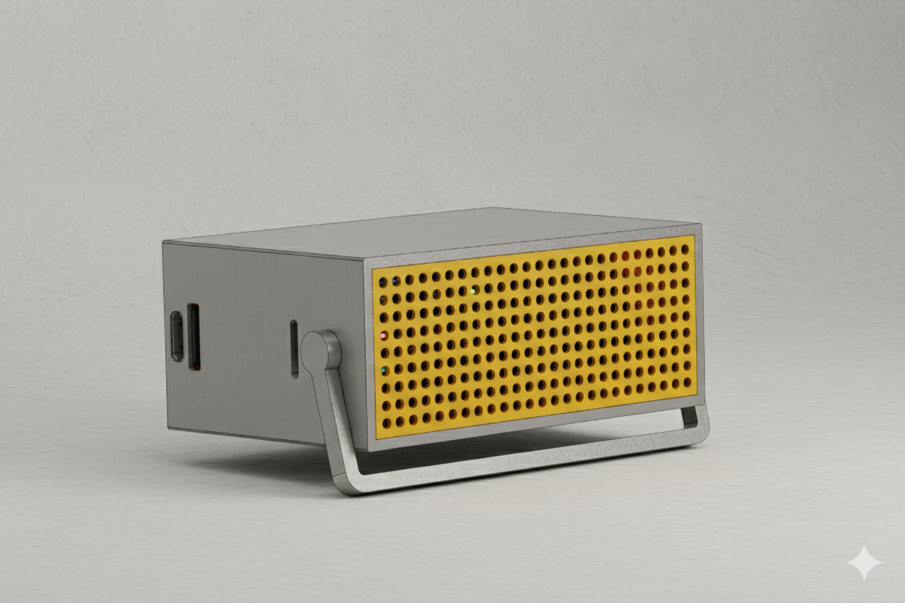

# Ambient Edu

An educational air quality monitoring kit by [Ambient Works](https://ambientworks.io). Designed for students, makers, and educators to learn about environmental sensing with real hardware.

<p align="center">
  
</p>

> **Note:** Photo placeholder — replace `images/ambient-edu-kit.jpg` with an actual kit photo.

---

## What's in the Kit

| Component | Description |
|---|---|
| **SparkFun ESP32-C6 Thing Plus** | Wi-Fi 6 & BLE microcontroller with USB-C, Qwiic connector, and onboard WS2812 LED. [Hardware guide →](https://docs.sparkfun.com/SparkFun_Thing_Plus_ESP32_C6/hardware_overview/) |
| **Sensirion SEN66** | All-in-one environmental sensor measuring PM1.0, PM2.5, PM4, PM10, CO₂, VOC, NOx, temperature, and humidity. [Product page →](https://sensirion.com/products/catalog/SEN66) · [Datasheet (PDF) →](https://sensirion.com/media/documents/SEN6x_Datasheet.pdf) |
| **Lithium-Ion Battery** | 3500 mAh rechargeable battery for portable monitoring |
| **3D-Printed Enclosure** | Printable case for the kit — STL files in the [`3d-files/`](3d-files/) folder |
| **Qwiic Cable** | Pre-wired I²C cable to connect the sensor to the board (no soldering needed) |

---

## Getting Started

### 1. Install Arduino IDE

Download and install [Arduino IDE 2.x](https://www.arduino.cc/en/software).

### 2. Add ESP32-C6 Board Support

1. Open **File → Preferences**
2. In **Additional Board Manager URLs**, add:
   ```
   https://espressif.github.io/arduino-esp32/package_esp32_index.json
   ```
3. Go to **Tools → Board → Boards Manager**, search for **esp32**, and install **esp32 by Espressif Systems**
4. Select **Tools → Board → esp32 → SparkFun esp32-c6 Thing Plus**

### 3. Install Required Libraries

Open **Sketch → Include Library → Manage Libraries** and install:

- **Adafruit NeoPixel** — for the onboard LED
- **Sensirion I2C SEN66** — for the SEN66 sensor (also installs Sensirion Core automatically)
- **ArduinoBLE** — for the BLE broadcast example
- **ESPSupabase** — for the Supabase data logger example
- **Adafruit MAX1704X** *(optional)* — for battery level monitoring

### 4. Connect the Hardware

1. Connect the SEN66 to the SparkFun board using the Qwiic cable
2. Plug in the USB-C cable to your computer
3. Select the correct port in **Tools → Port**

### 5. Upload an Example

Open one of the example sketches from the [`examples/`](examples/) folder, verify, and upload!

---

## Examples

### [`01-sensor-read.ino`](examples/01-sensor-read/01-sensor-read.ino)
**Read sensor data + LED colour alert**

Reads all 9 measurements from the SEN66 and prints them to Serial Monitor every second. A simple `if/else` block changes the LED colour based on PM2.5 levels — edit the thresholds to experiment with different pollutants.

What you'll learn:
- I²C sensor communication
- Reading environmental data
- Controlling a NeoPixel LED
- Using serial output for debugging

---

### [`02-local-api.ino`](examples/02-local-api/02-local-api.ino)
**Wi-Fi sensor API + history logging**

Connects the board to your Wi-Fi network and starts a lightweight web server. Any device on the same network can request live or historical readings over HTTP — useful for dashboards, spreadsheets, or your own apps.

**Setup:** Edit the `ssid` and `password` variables near the top of the sketch before uploading. (you are limited to 2.4GHz networks)

What you'll learn:
- Connecting to Wi-Fi with the ESP32
- Serving HTTP responses with `WebServer`
- Formatting sensor data as JSON
- Storing readings to on-device flash with LittleFS
- Syncing time over the internet with NTP

#### Endpoints

| Method | Endpoint | Description |
|---|---|---|
| `GET` | `/api` | Returns the latest sensor reading as JSON |
| `GET` | `/api/history` | Returns up to 48 hours of readings as a JSON array |
| `GET` | `/api/history/csv` | Downloads the full history as a CSV file |
| `DELETE` | `/api/history/clear` | Erases all stored history from the device |

The board logs one reading per minute and keeps up to 2,880 readings (48 hours) in flash storage. Example response from `/api`:

```json
{
  "timestamp": "2025-01-01T12:00:00Z",
  "pm1p0": 3.21,
  "pm2p5": 4.56,
  "pm4p0": 5.10,
  "pm10p0": 6.03,
  "humidity": 52.30,
  "temperature": 22.10,
  "vocIndex": 101.00,
  "noxIndex": 1.00,
  "co2": 612
}
```

---

### [`03-ble-broadcast.ino`](examples/03-ble-broadcast/03-ble-broadcast.ino)
**Broadcast sensor data over Bluetooth Low Energy**

Advertises the board as **"Ambient Edu XX"** (where XX is your device ID) and exposes sensor readings over BLE. Any BLE scanner app (nRF Connect, LightBlue, etc.) can read the values immediately — no custom app needed.

**Setup:** Change `DEVICE_ID` (1–99) at the top of the sketch so each student's board gets a unique BLE name and LED colour. The LED flashes on startup so you can visually identify your board.

Sensor data is grouped into three characteristics so an app only needs to subscribe to the groups it cares about:

What you'll learn:
- Setting up a BLE peripheral with GATT services
- Packing multiple values into a single characteristic
- Encoding sensor data as raw bytes (little-endian floats)
- Handling client connect/disconnect events

#### Characteristic Map

Service UUID: `12340001-1234-1234-1234-123456789abc`

**Particles** — UUID `...0010` — 16 bytes

| Offset | Field | Type | Unit |
|---|---|---|---|
| 0 | PM 1.0 | float (4B) | µg/m³ |
| 4 | PM 2.5 | float (4B) | µg/m³ |
| 8 | PM 4.0 | float (4B) | µg/m³ |
| 12 | PM 10 | float (4B) | µg/m³ |

**Gases** — UUID `...0011` — 10 bytes

| Offset | Field | Type | Unit |
|---|---|---|---|
| 0 | CO₂ | uint16 (2B) | ppm |
| 2 | VOC Index | float (4B) | index |
| 6 | NOx Index | float (4B) | index |

**Environment** — UUID `...0012` — 8 bytes

| Offset | Field | Type | Unit |
|---|---|---|---|
| 0 | Temperature | float (4B) | °C |
| 4 | Humidity | float (4B) | %RH |

**Battery** *(optional)* — UUID `...0013` — 12 bytes

| Offset | Field | Type | Unit |
|---|---|---|---|
| 0 | State of Charge | float (4B) | % (capped at 100) |
| 4 | Voltage | float (4B) | V |
| 8 | Charge Rate | float (4B) | %/hr (positive = charging) |

All multi-byte values are **little-endian** (float = IEEE 754, uint16 = unsigned).

---

### [`04-supabase.ino`](examples/04-supabase/04-supabase.ino)
**Push sensor data to a Supabase database**

Reads all 9 measurements from the SEN66 every minute and uploads them to a [Supabase](https://supabase.com) database via the REST API. Device metadata (student name, email, location) is registered in a `devices` table on first run and kept up to date on each cycle.

**Setup:** Edit the student config and Supabase credentials near the top of the sketch before uploading:

```cpp
const char* STUDENT_NAME  = "Your Name";
const char* STUDENT_EMAIL = "you@example.com";

const float LOCATION_LATITUDE    = 51.5074;
const float LOCATION_LONGITUDE   = -0.1278;
const char* LOCATION_DESCRIPTION = "Classroom 3B";

const char* SUPABASE_URL      = "https://<project-ref>.supabase.co";
const char* SUPABASE_ANON_KEY = "<anon-key>";
```

What you'll learn:
- Sending HTTP POST requests to a REST API
- Formatting sensor data as JSON
- Using NTP to timestamp readings
- Registering and tracking devices in a database
- Deriving a unique device ID from the MAC address

#### Required Library

Install **ESPSupabase** from Library Manager in addition to the libraries listed in [Getting Started](#3-install-required-libraries).

#### Database Tables

Make sure to **Disable** RLS on both tables

**`devices`** — one row per device+student combination, upserted on first connection:

```SQL
create table public.devices (
  device_id text not null,
  student_name text null,
  student_email text null,
  kit_number text null,
  location_description text null,
  latitude numeric null,
  longitude numeric null,
  last_seen timestamp with time zone null,
  created_at timestamp with time zone not null default now(),
  id uuid not null default gen_random_uuid (),
  constraint devices_pkey primary key (id),
  constraint devices_device_student_unique unique (device_id, student_email)
) TABLESPACE pg_default;
```

**`sensor_readings`** — one row per reading (logged every 60 seconds):

```SQL
create table public.sensor_readings (
  id uuid not null default gen_random_uuid (),
  device_id text null,
  timestamp timestamp with time zone null,
  pm1_0 numeric null,
  pm2_5 numeric null,
  pm4_0 numeric null,
  pm10_0 numeric null,
  temperature numeric null,
  humidity numeric null,
  co2 numeric null,
  nox_index numeric null,
  voc_index numeric null,
  created_at timestamp with time zone not null default now(),
  device_uuid uuid null,
  constraint sensor_readings_pkey primary key (id),
  constraint sensor_readings_device_uuid_fkey foreign KEY (device_uuid) references devices (id)
) TABLESPACE pg_default;
```

---

### Battery Monitoring (Optional)

The SparkFun ESP32-C6 Thing Plus has a MAX17048 fuel gauge on the I²C bus. All example sketches include an **optional** battery monitoring feature.

To enable it:
1. Install **Adafruit MAX1704X** from Library Manager
2. Uncomment `#define ENABLE_BATTERY` near the top of the sketch

When enabled, battery percentage and voltage are printed to Serial (and included in API responses / BLE characteristics where applicable).

---

## Board Configuration

The example sketches support two boards via a `#define` at the top of each file:

```cpp
#define BOARD_AMBIENT_ONE       // Ambient One PCB (if you have one)
// #define BOARD_SPARKFUN_C6    // SparkFun ESP32-C6 Thing Plus (default for this kit)
```

Uncomment the line matching your board. The pin mappings adjust automatically:

| Pin | SparkFun C6 | Ambient One |
|---|---|---|
| NeoPixel LED | GPIO 23 | GPIO 23 |
| I²C SDA | GPIO 6 | GPIO 19 |
| I²C SCL | GPIO 7 | GPIO 20 |
| Power Enable | — | GPIO 15 |

---

## Sensor Reference

The SEN66 measures 9 environmental parameters:

| Parameter | Unit | Typical Range | Notes |
|---|---|---|---|
| PM1.0 | µg/m³ | 0 – 1000 | Fine particulate matter |
| PM2.5 | µg/m³ | 0 – 1000 | Most commonly regulated PM size |
| PM4.0 | µg/m³ | 0 – 1000 | Coarse particulate matter |
| PM10 | µg/m³ | 0 – 1000 | Total inhalable particles |
| CO₂ | ppm | 400 – 5000+ | Carbon dioxide |
| VOC Index | 0 – 500 | 100 = normal | Volatile organic compounds |
| NOx Index | 0 – 500 | 1 = normal | Nitrogen oxides |
| Temperature | °C | -10 – 50 | ±0.45°C accuracy |
| Humidity | %RH | 0 – 100 | ±4.5%RH accuracy |

> **Warm-up:** VOC and NOx indices need approximately 60 seconds after power-on to produce meaningful readings. PM and CO₂ stabilise faster but benefit from a few minutes of run time.

---

## Air Quality Thresholds

These are the thresholds used by Ambient Works to categorise air quality. Use them in the example sketches to set LED colours or trigger alerts for any pollutant.

### PM2.5 (µg/m³)

| Level | Range | Description |
|---|---|---|
| 🟢 Good | 0 – 12 | Clean air, no action needed |
| 🟡 Moderate | 12 – 35 | Acceptable for most people |
| 🟠 Poor | 35 – 140 | May affect sensitive individuals |
| 🔴 Severe | > 140 | Unhealthy — reduce exposure |

### PM10 (µg/m³)

| Level | Range | Description |
|---|---|---|
| 🟢 Good | 0 – 45 | Clean air |
| 🟡 Moderate | 45 – 75 | Acceptable |
| 🟠 Poor | 75 – 150 | Elevated coarse particles |
| 🔴 Severe | > 150 | Unhealthy |

### CO₂ (ppm)

| Level | Range | Description |
|---|---|---|
| 🟢 Good | 400 – 1000 | Well ventilated |
| 🟡 Moderate | 1000 – 1500 | Room could use fresh air |
| 🟠 Poor | 1500 – 5000 | Stuffy — open a window |
| 🔴 Severe | > 5000 | Dangerous — ventilate immediately |

### VOC Index

| Level | Range | Description |
|---|---|---|
| 🟢 Good | 0 – 150 | Low volatile organic compounds |
| 🟡 Moderate | 150 – 250 | Noticeable odours possible |
| 🟠 Poor | 250 – 450 | High VOC — check for sources |
| 🔴 Severe | > 450 | Very high — ventilate and investigate |

### NOx Index

| Level | Range | Description |
|---|---|---|
| 🟢 Good | 0 – 20 | Clean air |
| 🟡 Moderate | 20 – 100 | Slightly elevated |
| 🟠 Poor | 100 – 400 | High — possible combustion source |
| 🔴 Severe | > 400 | Very high — ventilate |

### Temperature (°C) & Humidity (%RH)

| Level | Temperature | Humidity |
|---|---|---|
| 🟢 Comfortable | < 25°C | < 60% |
| 🟡 Warm / Humid | 25 – 30°C | 60 – 70% |
| 🟠 Hot / Very Humid | 30 – 35°C | 70 – 80% |
| 🔴 Very Hot / Excessive | > 35°C | > 80% |

### Using thresholds in code

The example sketch uses PM2.5 by default — swap the variable and thresholds to monitor any pollutant:

```cpp
// Example: CO2 alert instead of PM2.5
if (co2 < 1000) {
  pixel.setPixelColor(0, pixel.Color(0, 255, 0));     // Green
} else if (co2 < 1500) {
  pixel.setPixelColor(0, pixel.Color(255, 180, 0));   // Yellow
} else if (co2 < 5000) {
  pixel.setPixelColor(0, pixel.Color(255, 80, 0));    // Orange
} else {
  pixel.setPixelColor(0, pixel.Color(255, 0, 0));     // Red
}
```

---

## 3D-Printed Enclosure

STL files for the enclosure are in the [`3d-files/`](3d-files/) folder.

**Print settings (recommended):**
- Material: PLA or PETG
- Layer height: 0.2 mm
- Infill: 15–20%
- No supports needed

---

## Troubleshooting

| Problem | Solution |
|---|---|
| **No serial output** | Make sure baud rate is set to **115200** in Serial Monitor |
| **Sensor not found / I²C error** | Check Qwiic cable is seated firmly on both ends |
| **All readings show 0 or 65535** | Sensor is still warming up — wait 60 seconds |
| **LED doesn't light up** | Verify the correct board is selected in the `#define` at the top |
| **Upload fails** | See the **Manual Boot Mode** section below |

### Manual Boot Mode (Upload Fails)

If uploading fails with a connection error, you need to put the board into **boot mode** manually. The **BOOT** and **RESET** buttons are on the back of the SparkFun board:

<p align="center">
  
</p>

> **Note:** Photo placeholder — replace `images/sparkfun-c6-buttons.jpg` with an actual photo of the board's rear showing the buttons.

**Steps:**

1. Press and **hold** the **BOOT** button (keep holding it)
2. While still holding BOOT, press and **release** the **RESET** button
3. **Release** the BOOT button
4. The board is now in boot mode — click **Upload** in Arduino IDE
5. After upload completes, press **RESET** once to start your sketch

You only need to do this if the normal upload doesn't work. Once the sketch is running, future uploads usually work without manual boot mode.

---

## License

This project is licensed under the [Creative Commons Attribution-NonCommercial-ShareAlike 4.0 International License](LICENSE) (CC BY-NC-SA 4.0).

You are free to:
- **Share** — copy and redistribute the material
- **Adapt** — remix, transform, and build upon the material

Under the following terms:
- **Attribution** — You must give appropriate credit to [Ambient Works](https://ambientworks.io)
- **NonCommercial** — You may not use the material for commercial purposes
- **ShareAlike** — If you remix or build upon the material, you must distribute your contributions under the same license

This kit incorporates open-source components from [Sensirion](https://github.com/Sensirion) (BSD), [SparkFun](https://www.sparkfun.com/) (MIT), and [Adafruit](https://www.adafruit.com/) (MIT). See individual library licenses for details.

---

<p align="center">
  Made with ❤️ by <a href="https://ambientworks.io">Ambient Works</a>
</p>
